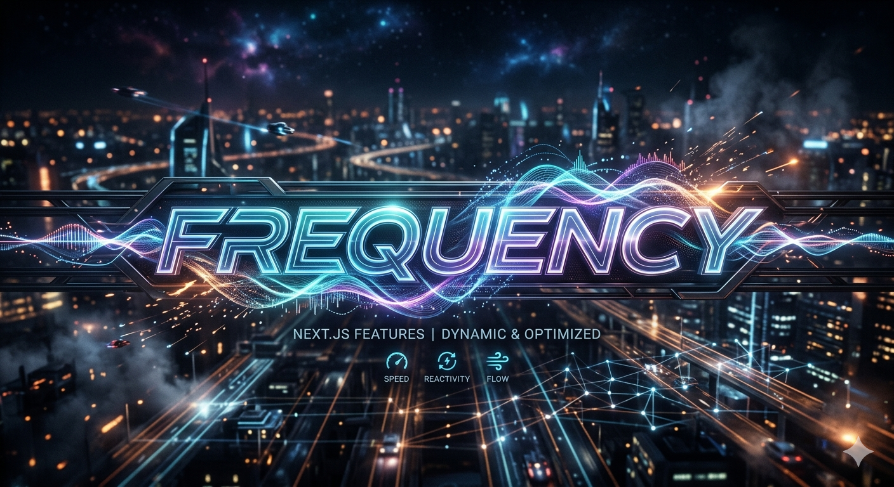

# 🎛️ Frequency

[](https://opensource.org/licenses/MIT)
[](https://github.com/credkellar-boop/Frequency/stargazers)
[](https://github.com/credkellar-boop/Frequency/network/members)
[](https://github.com/credkellar-boop/Frequency/issues)
[](https://hub.docker.com/r/credkellar/frequency)
[](https://hub.docker.com/r/credkellar/frequency)
[](https://nextjs.org/)
[](https://fastapi.tiangolo.com/)

**Frequency** is the ultimate AI-powered audio ecosystem. It seamlessly dissects, transcribes, and translates music while performing precision frequency analysis and manipulation. From real-time stem separation and MIDI extraction to automated pitch correction and studio-grade DSP, it turns raw audio into actionable data.

---

## ✨ Core Features

* **🎙️ Stem Separation:** Studio-grade isolation of vocals, drums, bass, and other elements using advanced models (`Demucs`, `Spleeter`).
* **📝 AI Transcription & Translation:** Automated, highly accurate speech-to-text and translation leveraging `OpenAI Whisper`.
* **🎚️ Studio-Grade DSP:** Precision frequency analysis, automated pitch correction, and audio manipulation using `librosa`, `scipy`, and `pedalboard`.
* **⚡ High-Performance API:** Lightning-fast backend powered by `FastAPI` and `Uvicorn` for seamless data processing.
* **🌊 Dynamic Client Interface:** Modern frontend built with Next.js/React, featuring interactive audio players and real-time waveform visualization.

---

## 🏗️ Project Structure

```text
Frequency/
├── .github/
│   └── workflows/
│       └── docker-publish.yml    # CI/CD pipeline for Docker Hub
├── api/
│   ├── index.py                  # FastAPI application entry point
│   └── routes.py                 # API routing and endpoint definitions
├── client/
│   └── src/
│       ├── app/api/process/      # Next.js API routes (route.ts)
│       ├── components/
│       │   ├── Analysis/         # e.g., TranscriptionView.tsx
│       │   └── AudioPlayer/      # e.g., Waveform.tsx
│       └── store/
│           └── useAudioStore.ts  # Zustand state management
├── core/
│   ├── frequency_engine.py       # Core DSP and frequency manipulation logic
│   ├── quantum_unit.py           # Central processing unit for audio tasks
│   ├── separator.py              # Stem separation logic (Demucs integration)
│   └── transcriber.py            # Whisper model integration for transcription
├── utils/                        # Helper functions and utilities
├── .gitignore
├── Dockerfile                    # Containerization configuration
├── LICENSE                       # MIT License
├── README.md                     # You are here
├── requirements.txt              # Python dependencies
└── vercel.json                   # Vercel deployment configuration
